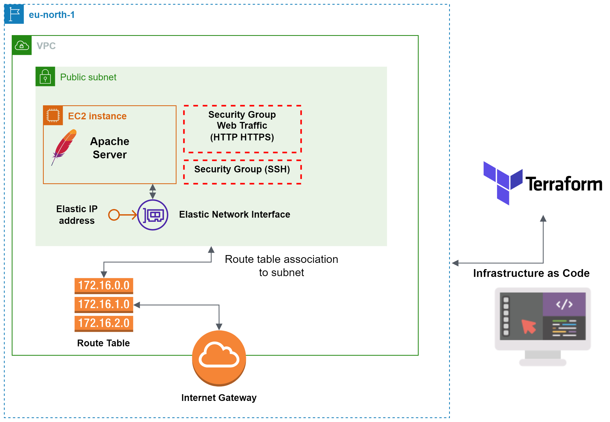

# terraform-project

Infrastructure as code deployement plan:

- Set up a VPC with an Internet Gateway
- Create a public subnet within the VPC
- Associate a route table to the subnet
- Create two security groups for: 
    - Secure remote access (SSH) 
    - Web traffic (HTTP and HTTPS)  
- Create a network interface 
- Provision an Elastic IP address 
- Launch an EC2 instance 
- Install and setup an apache server with user data bootstrap file

